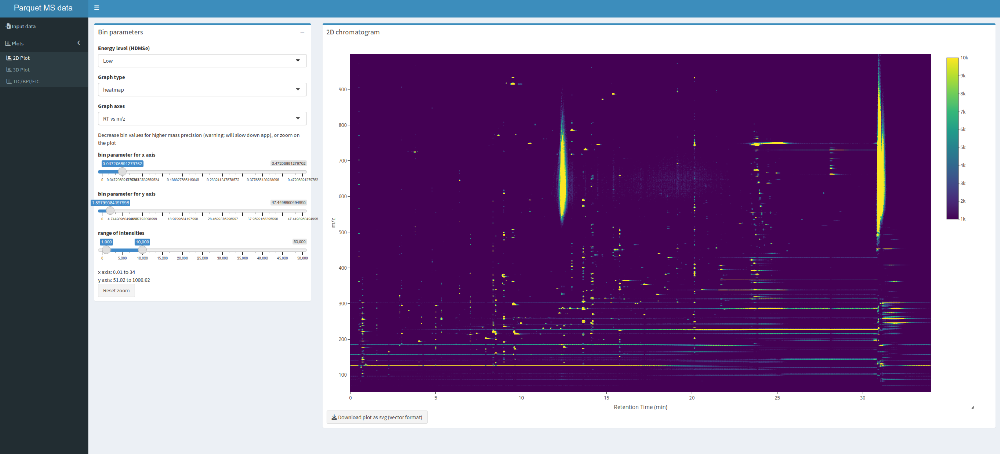
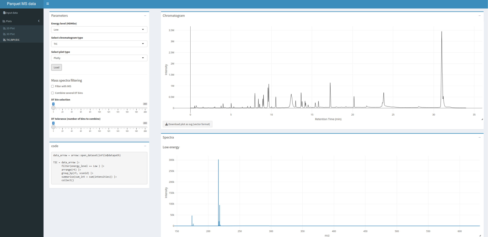

# 🏹 arcMS Parquet data visualization app

<!-- badges: start -->
<!-- badges: end -->

This Shiny app provides an interface to quickly visualize HRMS data
converted to Parquet files with the [arcMS
package](https://github.com/leesulab/arcMS).

Input data must be a table in the [Apache
Parquet](https://parquet.apache.org/) format and created with the
`arcMS` package.

Data is not fully loaded in RAM but chromatograms and MS spectra are
quickly retrieved from the parquet file with the [Apache Arrow
library](https://arrow.apache.org/).

<figure>

<figcaption aria-hidden="true">2D plot example</figcaption>
</figure>

<figure>

<figcaption aria-hidden="true">Total Ion Chromatogram (TIC) and MS
spectrum</figcaption>
</figure>
